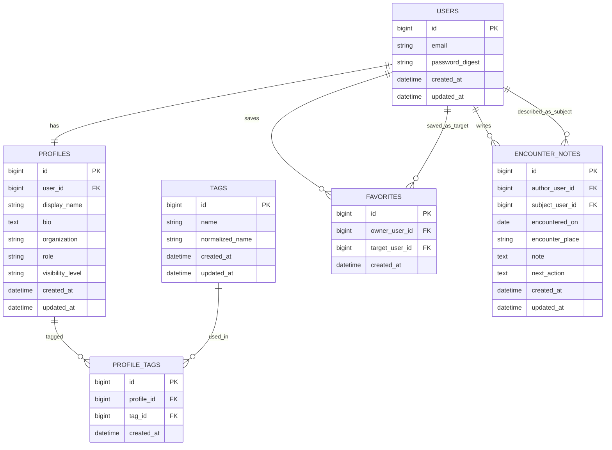
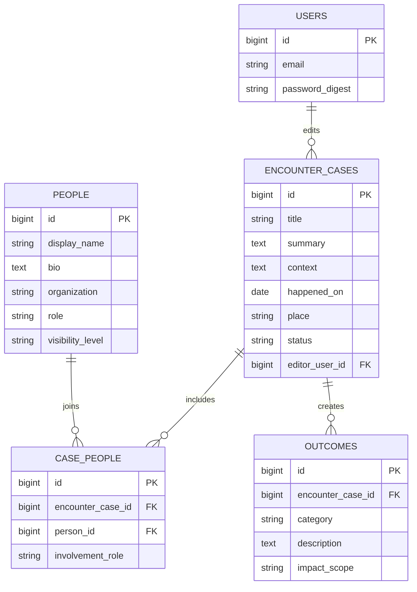

# Tsunagari

Tsunagari は、「出会いからより良くなる」を第一方針にした Web サービスです。
人との出会いが、仕事、学び、暮らし、地域、コミュニティをどう良くしたのかを
記録し、再現しやすくすることで、人と社会の前進を支える Rails アプリを目指します。

この README は、開発序盤における仕様書兼セットアップ手順です。
詳細設計よりも、MVP の判断と初期実装の現実性を優先しています。
現行実装は前段の MVP を引き継いでいるため、公開面は情報サイト、ログイン後は
編集メンバー向けの管理画面として読み替えながら進めます。現時点の実装は
人物中心ですが、今後は「出会い」「変化」「再現性」を主役に寄せます。

## 0. 北極星

Tsunagari の北極星は次の 1 文です。

`良い出会いの構造を記録し、その再現性を高めることで、人と社会を前に進める。`

このサービスは、例外的な成功者を礼賛するための場ではありません。
人類発展という大きな目標に対して、現実的には次の 3 点を積み上げます。

- どんな出会いが、どんな前進を生んだのかを記録する
- その前進が起きた条件や文脈を読み解けるようにする
- 読んだ人が次の一歩に転用できる形で残す

## 1. プロダクト概要

最初から SNS を作るのではなく、次の 4 点に絞ります。

- 人物そのものより、出会いが生んだ良い変化を読めるようにする
- 誰と誰がどう出会い、何が前進したのかを辿れるようにする
- 良い出会いが起きた条件を、再利用しやすい形で残せるようにする
- 公開人物録と出会い事例を編集メンバーが蓄積できるようにする

## 2. 解決したい課題

人との繫りを扱うサービスは多いですが、出会いによって何が良くなったのかを
まとまって読める場所は多くありません。

- 仕事が進んだ
- 学びが深まった
- 共同制作や挑戦が始まった
- 視野や行動が変わった
- コミュニティが少し良くなった

一般的な SNS は日常的な交流や発信には強い一方で、出会いの文脈や、その後に
起きた前向きな変化を整理して読む用途には向きません。Tsunagari は
「誰と出会ったか」だけでなく、「その出会いで何がより良くなったか」と
「それがなぜ起きたか」を伝えることを主目的にします。

## 3. 想定ユーザー

初期ターゲットは、出会いがもたらした良い変化を知りたい読者と、その情報を
整備する編集メンバーです。

- 出会いの事例から学びや勇気を得たい読者
- 協働、紹介、伴走のような前向きな関係の背景を知りたい人
- 次の挑戦を起こすヒントを探している人
- 人物録と出会いの事例を整備、更新、蓄積したい編集メンバー

## 4. 提供価値

### 4.1 公開面の価値

公開サイトとして、出会いから生まれた良い変化を読みやすく整理します。

- 公開人物録を一覧で辿れる
- 専門性、所属、役割、タグで横断検索できる
- 出会いの起点、背景、変化の兆しを補助情報として残せる
- 読んだ人が次の一歩のヒントを得られる
- 良い出会いの構造を再現可能な知見として蓄積できる

### 4.2 編集面の価値

ログイン後は、出会いの背景や変化を整理するための編集画面として使います。

- `favorites` で注目人物を追える
- `encounter_notes` で取材メモや関係メモを残せる
- `visibility_level` で公開範囲を制御できる
- 将来の出会い事例化に向けた下書きを蓄積できる

## 5. MVP の範囲

初期版では「人物を入口に出会いの価値を読む」「人物を探す」「編集メモを蓄積する」までを成立させます。
MVP 後に、正式な「出会い事例」と「成果」を独立した単位で扱います。

### 5.1 実装対象

- トップページ
- 公開人物録一覧
- 公開人物詳細
- 名前、タグ、所属などによる検索
- 編集メンバー登録 / ログイン
- 編集プロフィール作成・編集
- 注目人物リスト
- 取材メモの保存
- 公開範囲の設定
- 出会いによる変化を説明する文言の整理
- 再現性の仮説を編集メモに残す運用

### 5.2 実装しないもの

- ダイレクトメッセージ
- 既読管理
- 通知一覧
- 相互承認型のコネクション
- レコメンドアルゴリズム
- タイムラインや投稿機能
- 招待、紹介、グループ機能
- 通報、ブロック、モデレーション機能
- 公開グラフ可視化
- 編集部と寄稿者の厳密な権限分離
- 出会い事例の厳密な公開ワークフロー

### 5.3 仕様上の判断

- `favorites` は編集用の注目人物リストとして先に実装する
- `encounter_notes` は編集メンバー本人だけが見える private memo とする
- 公開人物録は `public` のみ未ログイン閲覧可能とする
- `member` は編集メンバーのみ閲覧可能とする
- 正式な「出会い事例」はまだ独立テーブル化せず、当面は人物録と編集メモで運用する
- 人物録は入口であり、最終的な主役は出会い事例と成果である

## 6. 主要ユースケース

### 6.1 読者として出会いの価値を読む

1. トップページから人物録一覧へ進む
2. 名前、タグ、所属、役割で検索する
3. 公開中の人物詳細を読む
4. その人物がどんな出会いの起点になり得るかを掴む
5. 次の挑戦に転用できるヒントを持ち帰る

### 6.2 編集メンバーとして公開情報を整える

1. 編集メンバー登録またはログインする
2. 編集プロフィールを整える
3. 公開範囲を設定する

### 6.3 編集メモを蓄積する

1. 人物詳細を開く
2. 注目人物として保存する
3. 取材メモや関係メモを残す
4. その出会いで何が良くなったのかを編集メモに蓄積する
5. 将来の事例公開に向けて、再現条件の仮説を残す

## 7. 画面一覧

| 画面 | 目的 |
| --- | --- |
| トップ | 「出会いからより良くなる」という価値と導線を出す |
| 編集ログイン / 編集メンバー登録 | 編集用認証を行う |
| 編集プロフィール | 編集メンバー自身の公開情報を確認する |
| 編集プロフィール設定 | 表示名、所属、タグ、公開範囲を編集する |
| 人物録一覧 | 名前、所属、タグで人物を探す |
| 人物詳細 | 公開されている人物情報と出会いの背景を読む入口にする |
| 注目人物一覧 | 編集上追っている人物を見返す |
| 将来の出会い事例一覧 | 何がより良くなったのかを事例単位で読む |

## 8. データベース設計案

結論として、現行の MVP データベース設計はそのまま活かせます。
ただし第一方針に完全には一致していません。いまの設計は「人物」を中心にした
暫定設計であり、将来的には「出会い」と「変化」を中心にしたモデルへ拡張する
必要があります。

初期実装ではテーブルを増やしすぎない方が良いので、次のように整理します。

- `visibility_settings` は独立テーブルにしない
- `connections` は作らず、まずは `favorites` のみで始める
- `organizations` も独立テーブルにせず、最初は `profiles.organization` の文字列で持つ
- `encounter_notes` は「ユーザー間の1件要約」ではなく「接点ごとの履歴」として持つ
- 正式な出会い事例テーブルは次段階で追加する

### 8.1 採用するテーブル

| テーブル | 役割 | 主なカラム |
| --- | --- | --- |
| `users` | 編集メンバーの認証主体 | `email`, `password_digest` |
| `profiles` | 公開人物票の原型 | `user_id`, `display_name`, `bio`, `organization`, `role`, `visibility_level` |
| `tags` | 検索用ラベル | `name`, `normalized_name` |
| `profile_tags` | タグの中間テーブル | `profile_id`, `tag_id` |
| `favorites` | 編集上の注目人物 | `owner_user_id`, `target_user_id` |
| `encounter_notes` | 取材メモ / 関係メモの履歴 | `author_user_id`, `subject_user_id`, `encountered_on`, `encounter_place`, `note`, `next_action` |

### 8.2 テーブルごとの設計

#### `users`

編集メンバーの認証主体です。MVP では認証に必要なものだけに絞ります。

- `email`: not null, unique
- `password_digest`: not null
- `created_at`, `updated_at`

補足:

- 状態管理や招待制は後で追加できます
- セッションは Cookie ベースで始めるなら、DB テーブルは必須ではありません

#### `profiles`

初期段階では、1編集メンバーにつき1件の公開人物票を持つ前提にします。
最終的には掲載人物と編集アカウントを分ける可能性があります。さらに
「この人物がどんな出会いから何を良くしたか」は、別モデルで扱う前提です。

- `user_id`: not null, unique
- `display_name`: not null
- `bio`: text, null allowed
- `organization`: string, null allowed
- `role`: string, null allowed
- `visibility_level`: not null, default `member`
- `created_at`, `updated_at`

設計判断:

- `visibility_level` は `profiles` に持たせる
- 初期段階で `visibility_settings` を別テーブルにすると過剰
- 項目単位の公開制御が必要になった段階で分離を検討する

#### `tags`

検索と人物分類に使います。

- `name`: not null
- `normalized_name`: not null, unique
- `created_at`, `updated_at`

設計判断:

- `name` は表示用
- `normalized_name` は重複防止と検索用
- 例: `Ruby on Rails` と `ruby on rails` を同一タグとして扱いやすくする

#### `profile_tags`

プロフィールとタグの多対多を表します。

- `profile_id`: not null
- `tag_id`: not null
- `created_at`

制約:

- `unique(profile_id, tag_id)`

#### `favorites`

編集上、注目している人物を保存するための片方向テーブルです。

- `owner_user_id`: not null
- `target_user_id`: not null
- `created_at`

制約:

- `unique(owner_user_id, target_user_id)`
- `owner_user_id != target_user_id`

設計判断:

- 相手への通知はしない
- 相互承認を必要とする `connections` は初期段階では持たない
- ユーザー間の関係は `profiles` ではなく `users` にぶら下げる

#### `encounter_notes`

取材や関係の背景、そこから起きた変化の仮説を覚えておくための private memo です。

- `author_user_id`: not null
- `subject_user_id`: not null
- `encountered_on`: date, null allowed
- `encounter_place`: string, null allowed
- `note`: text, not null
- `next_action`: text, null allowed
- `created_at`, `updated_at`

設計判断:

- 1ユーザーに対して1メモではなく、観点の数だけ複数保存できるようにする
- 作成者本人だけが閲覧・編集できる
- 関係の履歴として残したいので unique 制約は付けない

### 8.3 推奨インデックスと制約

- `users.email` に unique index
- `profiles.user_id` に unique index
- `tags.normalized_name` に unique index
- `profile_tags(profile_id, tag_id)` に unique index
- `favorites(owner_user_id, target_user_id)` に unique index
- `encounter_notes(author_user_id, subject_user_id)` に index
- すべての外部キーに foreign key 制約を付ける

### 8.4 MVP では見送るテーブル

以下は将来あり得ますが、現時点では不要です。

- `visibility_settings`
- `connections`
- `messages`
- `organizations`
- `notifications`
- `encounter_cases`
- `case_people`
- `outcomes`

### 8.5 次段階で追加したいモデル

第一方針に本格的に合わせるなら、次の 3 系統が必要です。

- `encounter_cases`: どんな出会いだったか
- `case_people`: その出会いに誰が関わったか
- `outcomes`: その出会いで何がより良くなったか

現行実装は、その前段として人物録と編集メモを整えるフェーズです。

各モデルの役割は次の通りです。

- `encounter_cases`: 出会いの概要、背景、場所、時期、テーマを持つ
- `case_people`: 誰がその出会いにどう関わったかを持つ
- `outcomes`: 仕事、学び、地域、コミュニティなど何が前進したかを持つ

この 3 系統が入ると、「人類発展」という大きな言葉を、具体的な
出会い事例の蓄積に落とせます。

## 9. ER 図

### 9.1 現在の MVP ER 図

初期実装を想定した最小構成です。`connections`、`messages`、`visibility_settings` はまだ入れていません。
情報サイト専用の厳密な編集モデルではなく、公開人物録の原型として運用します。



### 9.2 目標 ER 図

第一方針に沿う最終形では、人物は入口であり、主役は「出会い事例」と
「その結果」です。



## 10. 主要ルール

### 10.1 公開ルール

- 未ログインユーザーは `public` 情報のみ閲覧可能
- ログインユーザーは `member` 情報を閲覧可能
- `private` 情報は本人のみ閲覧可能
- MVP では `profiles.visibility_level` で全体制御する
- セクション単位の公開制御は後で必要になった時点で追加する

### 10.2 メモの扱い

- `encounter_notes` は作成者本人のみ閲覧・編集できる
- 相手には表示しない

### 10.3 保存機能

- `favorites` は編集用の注目人物リストとして扱う
- 相手への通知なし
- 相互関係の成立は扱わない
- 自分自身を保存できないようにする

## 11. 技術方針

初期構築は仕様変更に強いことを優先します。

- Rails モノリス
- PostgreSQL
- Hotwire / Turbo 中心
- 必要になるまで API 分離しない

## 12. 開発順

### Phase 1

- 情報サイトとしてのトップ
- 編集用認証
- 編集プロフィール

### Phase 2

- 人物録一覧
- タグ
- 人物詳細

### Phase 3

- 注目人物
- 取材メモ
- 公開範囲

### Phase 4

- 出会い事例
- より良くなった内容の整理
- 事例と人物の紐付け
- 再現条件の言語化

## 13. 未確定事項

- 最終的に編集アカウントと掲載人物を分離するか
- 公開範囲をプロフィール単位にするかセクション単位にするか
- `favorites` を注目人物リストのままにするか、関係アーカイブへ進化させるか
- 検索条件の最小セット
- 公開人物票に必要な初期項目
- 「より良くなった」をどう構造化するか
- 再現性をどの粒度で記述するか

## 14. 現在の実装状況

- 公開トップ
- 編集メンバー登録 / ログイン
- 編集プロフィール
- 人物録一覧 / 人物詳細
- 注目人物
- 取材メモ
- Ruby 3.3.9
- Rails 7.2.3
- PostgreSQL
- Hotwire via Turbo and Stimulus

公開面と編集面の両方に最低限の画面があります。
ただし、最終的な情報サイト専用データモデルにはまだ至っていません。

## 15. ローカルセットアップ

1. Ruby 3.3.9 と PostgreSQL をインストールする
2. gem をインストールする

```sh
bundle install
```

3. データベースを作成して初期化する

```sh
bin/rails db:prepare
```

4. アプリを起動する

```sh
bin/rails server
```

`http://localhost:3000` で起動します。

## 16. テスト

```sh
bin/rails test
```

テスト実行前に、ローカルの PostgreSQL が起動している必要があります。
