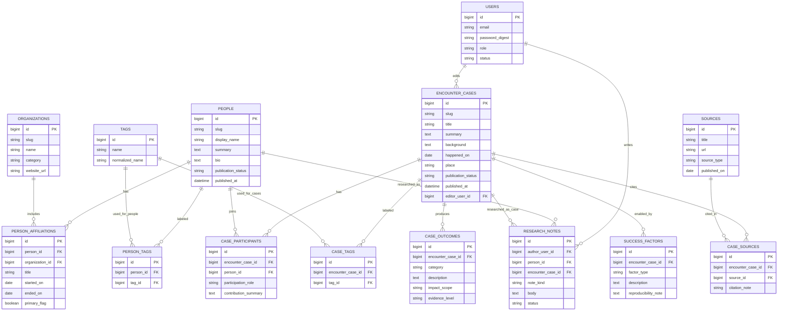

# Tsunagari

Tsunagari は、「出会いからより良くなる」を第一方針にした Web サービスです。
人との出会いが、仕事、学び、暮らし、地域、コミュニティをどう良くしたのかを
記録し、再現しやすくすることで、人と社会の前進を支える Rails アプリを目指します。

この README は、開発序盤における仕様書兼セットアップ手順です。
詳細設計よりも、MVP の判断と初期実装の現実性を優先しています。
現行実装は前段の MVP を引き継いでいるため、公開面は情報サイト、ログイン後は
編集メンバー向けの管理画面として読み替えながら進めます。現時点の実装は
人物中心ですが、今後は「出会い」「変化」「再現性」を主役に寄せます。

## 0. 北極星

Tsunagari の北極星は次の 1 文です。

`良い出会いの構造を記録し、その再現性を高めることで、人と社会を前に進める。`

このサービスは、例外的な成功者を礼賛するための場ではありません。
人類発展という大きな目標に対して、現実的には次の 3 点を積み上げます。

- どんな出会いが、どんな前進を生んだのかを記録する
- その前進が起きた条件や文脈を読み解けるようにする
- 読んだ人が次の一歩に転用できる形で残す

## 1. プロダクト概要

最初から SNS を作るのではなく、次の 4 点に絞ります。

- 人物そのものより、出会いが生んだ良い変化を読めるようにする
- 誰と誰がどう出会い、何が前進したのかを辿れるようにする
- 良い出会いが起きた条件を、再利用しやすい形で残せるようにする
- 公開人物録と出会い事例を編集メンバーが蓄積できるようにする

## 2. 解決したい課題

人との繫りを扱うサービスは多いですが、出会いによって何が良くなったのかを
まとまって読める場所は多くありません。

- 仕事が進んだ
- 学びが深まった
- 共同制作や挑戦が始まった
- 視野や行動が変わった
- コミュニティが少し良くなった

一般的な SNS は日常的な交流や発信には強い一方で、出会いの文脈や、その後に
起きた前向きな変化を整理して読む用途には向きません。Tsunagari は
「誰と出会ったか」だけでなく、「その出会いで何がより良くなったか」と
「それがなぜ起きたか」を伝えることを主目的にします。

## 3. 想定ユーザー

初期ターゲットは、出会いがもたらした良い変化を知りたい読者と、その情報を
整備する編集メンバーです。

- 出会いの事例から学びや勇気を得たい読者
- 協働、紹介、伴走のような前向きな関係の背景を知りたい人
- 次の挑戦を起こすヒントを探している人
- 人物録と出会いの事例を整備、更新、蓄積したい編集メンバー

## 4. 提供価値

### 4.1 公開面の価値

公開サイトとして、出会いから生まれた良い変化を読みやすく整理します。

- 公開人物録を一覧で辿れる
- 専門性、所属、役割、タグで横断検索できる
- 出会いの起点、背景、変化の兆しを補助情報として残せる
- 読んだ人が次の一歩のヒントを得られる
- 良い出会いの構造を再現可能な知見として蓄積できる

### 4.2 編集面の価値

ログイン後は、出会いの背景や変化を整理するための編集画面として使います。

- `people` を編集して公開人物録を整えられる
- `encounter_cases` を編集して事例を蓄積できる
- `research_notes` で仮説や下書きを残せる
- `sources` を紐付けて公開情報の根拠を持てる

## 5. MVP の範囲

初期版では「人物を入口に出会いの価値を読む」「人物を探す」「編集メモを蓄積する」までを成立させます。
MVP 後に、正式な「出会い事例」と「成果」を独立した単位で扱います。

### 5.1 実装対象

- トップページ
- 公開人物録一覧
- 公開人物詳細
- 公開事例一覧
- 公開事例詳細
- 名前、タグ、所属などによる検索
- 編集メンバー登録 / ログイン
- 人物作成・編集
- 出会い事例作成・編集
- 編集メモの保存
- 出典の登録
- 公開状態の管理

### 5.2 実装しないもの

- ダイレクトメッセージ
- 既読管理
- 通知一覧
- 相互承認型のコネクション
- レコメンドアルゴリズム
- タイムラインや投稿機能
- 招待、紹介、グループ機能
- 通報、ブロック、モデレーション機能
- 公開グラフ可視化
- 編集部と寄稿者の厳密な権限分離
- 出会い事例の厳密な公開ワークフロー

### 5.3 仕様上の判断

- `users` は編集アカウントとしてのみ扱う
- `people` と `encounter_cases` は `publication_status` で公開状態を管理する
- `research_notes` は編集メンバー本人だけが見える private memo とする
- 公開面に出すのは `published` のみとする
- 人物録は入口であり、最終的な主役は出会い事例と成果である

## 6. 主要ユースケース

### 6.1 読者として出会いの価値を読む

1. トップページから人物録一覧へ進む
2. 名前、タグ、所属、役割で検索する
3. 公開中の人物詳細を読む
4. その人物がどんな出会いの起点になり得るかを掴む
5. 次の挑戦に転用できるヒントを持ち帰る

### 6.2 編集メンバーとして公開情報を整える

1. 編集メンバー登録またはログインする
2. 人物を作成・編集する
3. 出会い事例を作成・編集する
4. 公開状態を設定する

### 6.3 編集メモを蓄積する

1. 人物詳細または事例詳細を開く
2. `research_notes` に仮説や調査メモを残す
3. `sources` を紐付けて根拠を整理する
4. その出会いで何が良くなったのかを公開データへ反映する
5. 将来の事例公開に向けて、再現条件の仮説を残す

## 7. 画面一覧

| 画面 | 目的 |
| --- | --- |
| トップ | 「出会いからより良くなる」という価値と導線を出す |
| 編集ログイン / 編集メンバー登録 | 編集用認証を行う |
| 人物録一覧 | 名前、所属、タグで人物を探す |
| 人物詳細 | 公開されている人物情報と出会いの背景を読む入口にする |
| 出会い事例一覧 | 何がより良くなったのかを事例単位で読む |
| 出会い事例詳細 | 背景、成果、要因、出典を読む |
| 人物編集 | 人物録を編集する |
| 出会い事例編集 | 事例と成果を編集する |

## 8. 基本設計としてのデータモデル

この基本設計が、そのまま現在の Rails 実装の正本です。
公開の中心は「出会い事例を中心に読む情報サイト」としての概念モデルです。

この基本設計で重視するのは次の 5 点です。

- 公開の主役は `people` ではなく `encounter_cases`
- `users` は編集アカウント、`people` は掲載対象として分ける
- `case_outcomes` で「何が良くなったか」を持つ
- `success_factors` で「なぜ起きたか / 再現のヒント」を持つ
- `sources` を別テーブルにして、情報サイトとして出典を明確にする

### 8.1 採用するコアテーブル

| テーブル | 役割 | 主なカラム |
| --- | --- | --- |
| `users` | 編集アカウント | `email`, `password_digest`, `role`, `status` |
| `people` | 公開される人物情報 | `slug`, `display_name`, `summary`, `bio`, `publication_status` |
| `organizations` | 会社、団体、地域、コミュニティ | `slug`, `name`, `category`, `website_url` |
| `person_affiliations` | 人物と組織の所属履歴 | `person_id`, `organization_id`, `title`, `started_on`, `ended_on` |
| `tags` | 検索用ラベル | `name`, `normalized_name` |
| `person_tags` | 人物へのタグ付け | `person_id`, `tag_id` |
| `encounter_cases` | 出会い事例の本体 | `slug`, `title`, `summary`, `background`, `happened_on`, `place`, `publication_status`, `editor_user_id` |
| `case_participants` | 事例に関わる人物 | `encounter_case_id`, `person_id`, `participation_role`, `contribution_summary` |
| `case_tags` | 事例へのタグ付け | `encounter_case_id`, `tag_id` |
| `case_outcomes` | その出会いで何が良くなったか | `encounter_case_id`, `category`, `description`, `impact_scope`, `evidence_level` |
| `success_factors` | なぜ起きたか / 再現のヒント | `encounter_case_id`, `factor_type`, `description`, `reproducibility_note` |
| `sources` | 出典情報 | `title`, `url`, `source_type`, `published_on` |
| `case_sources` | 事例と出典の紐付け | `encounter_case_id`, `source_id`, `citation_note` |
| `research_notes` | 非公開の編集メモ | `author_user_id`, `person_id`, `encounter_case_id`, `note_kind`, `body`, `status` |

### 8.2 設計判断

#### `users` と `people` は分ける

編集する人と掲載される人を同じテーブルにすると、権限と公開情報が混ざります。
基本設計では `users` は完全に編集用、公開対象は `people` に分離します。

#### 主役は `encounter_cases`

このサービスが残したいのは「誰がすごいか」ではなく、「どんな出会いが何を良くしたか」です。
そのため公開の中心単位は人物票ではなく `encounter_cases` です。`people` は入口です。

#### `case_outcomes` と `success_factors` は分ける

「何が良くなったか」と「なぜ起きたか」は別の情報です。これを1つの本文に混ぜると、
検索性と再利用性が落ちるので、結果と要因は別テーブルで持ちます。

#### `organizations` は正規化する

基本設計段階では、所属を文字列で持つよりも `organizations` と `person_affiliations` に分けた方が
後戻りしにくいです。人と組織の関係は複数かつ時系列を持つ前提で扱います。

#### `sources` を先に設計へ入れる

情報サイトとして運用する以上、公開情報の根拠が必要です。
最初の実装で全部は作らなくても、設計上は `sources` と `case_sources` を前提にします。

#### `research_notes` は private のまま残す

編集メモは公開データと分けて持ちます。人物や事例に対する仮説、次の調査方針、
公開前の下書きは `research_notes` に寄せます。

## 9. 基本設計 ER 図

この ER 図を、現時点の正本とします。現在の Rails 実装もこの図に合わせて構成しています。



## 10. 主要ルール

### 10.1 公開ルール

- `people` と `encounter_cases` は `publication_status` で公開状態を管理する
- `draft` / `review` は編集者のみ閲覧可能
- `published` のみ未ログインで閲覧可能
- `archived` は原則非表示にする

### 10.2 掲載品質ルール

- 公開する `encounter_case` には最低1件の `case_participant` が必要
- 公開する `encounter_case` には最低1件の `case_outcome` が必要
- 公開する `encounter_case` には最低1件の `case_source` が必要
- `success_factors` は仮説でもよいが、推測だけで断定しない

### 10.3 編集データの扱い

- `research_notes` は作成者を含む編集者のみ閲覧可能
- `research_notes` は公開面に出さない
- 人物と事例の本文は、公開用コンテンツとして別に整える

## 11. 技術方針

初期構築は仕様変更に強いことを優先します。

- Rails モノリス
- PostgreSQL
- Hotwire / Turbo 中心
- 必要になるまで API 分離しない
- 実装は基本設計 ER 図にあとから追従させる

## 12. 開発順

### Phase 1

- 編集用認証
- `people`
- `tags`
- 人物録一覧 / 人物詳細

### Phase 2

- `encounter_cases`
- `case_participants`
- `case_outcomes`
- 事例一覧 / 事例詳細

### Phase 3

- `organizations`
- `person_affiliations`
- `sources`
- `case_sources`

### Phase 4

- `success_factors`
- `research_notes`
- 編集ワークフロー

## 13. 未確定事項

- `people` と `organizations` の slug ルール
- `publication_status` の状態遷移
- `case_outcomes.category` の分類体系
- `success_factors.factor_type` の分類体系
- 出典の信頼度をどう扱うか
- 事例ページと人物ページの優先導線

## 14. 現在の実装状況

- 公開トップ
- 編集メンバー登録 / ログイン
- 人物録一覧 / 人物詳細 / 作成 / 編集
- 出会い事例一覧 / 詳細 / 作成 / 編集
- 編集メモ
- 出典紐付け
- Ruby 3.3.9
- Rails 7.2.3
- PostgreSQL
- Hotwire via Turbo and Stimulus

現在の Rails 実装は、この README の基本設計 ER 図に合わせて作り直しています。

## 15. ローカルセットアップ

1. Ruby 3.3.9 と PostgreSQL をインストールする
2. gem をインストールする

```sh
bundle install
```

3. データベースを作成して初期化する

```sh
bin/rails db:prepare
```

4. アプリを起動する

```sh
bin/rails server
```

`http://localhost:3000` で起動します。

## 16. テスト

```sh
bin/rails test
```

テスト実行前に、ローカルの PostgreSQL が起動している必要があります。
