# Tsunagari

Tsunagari は、「出会いからより良くなる」を第一方針にした Web サービスです。
人との出会いが、仕事、学び、暮らし、地域、コミュニティをどう変えたのかを
前進だけでなく停滞や失敗も含めて記録し、次に活かせる形へ整理することで、
人と社会の前進を支える Rails アプリを目指します。

この README は、開発序盤における仕様書兼セットアップ手順です。
詳細設計よりも、MVP の判断と初期実装の現実性を優先しています。
公開面と編集面を分けず、wiki のように誰でもその場で追記・編集できる構成で、
「出会い」「結果」「学び」を主役にした実装で進めます。
人物情報は自前で全文複製するのではなく、外部DBを正本にしつつ、
Tsunagari 独自の差分と事例だけを持つ方針へ寄せます。

## 0. 北極星

Tsunagari の北極星は次の 1 文です。

`出会いが生んだ前進と失敗の両方を記録し、次により良くするための再現性を高める。`

このサービスは、例外的な成功者を礼賛するための場ではありません。
人類発展という大きな目標に対して、現実的には次の 3 点を積み上げます。

- どんな出会いが、どんな前進や停滞、失敗を生んだのかを記録する
- その結果が起きた条件や文脈を読み解けるようにする
- 読んだ人が次の一歩に転用できる形で残す

## 1. プロダクト概要

最初から SNS を作るのではなく、次の 4 点に絞ります。

- 人物そのものより、出会いが生んだ変化と学びを読めるようにする
- 誰と誰がどう出会い、何が前進し、どこでつまずいたのかを辿れるようにする
- 良い出会いの条件と、避けるべき失敗の条件を再利用しやすい形で残せるようにする
- 外部DB上の人物情報を土台に、Tsunagari 独自の出会い事例だけを重ねられるようにする

## 2. 解決したい課題

人との繫りを扱うサービスは多いですが、出会いによって何が変わったのかを
前進も停滞も含めてまとまって読める場所は多くありません。

- 仕事が進んだ
- 学びが深まった
- 共同制作や挑戦が始まった
- 視野や行動が変わった
- コミュニティが少し良くなった

一般的な SNS は日常的な交流や発信には強い一方で、出会いの文脈や、その後に
起きた前進、停滞、失敗を整理して読む用途には向きません。Tsunagari は
「誰と出会ったか」だけでなく、「その出会いで何が起きたか」と
「そこから次に何を学べるか」を伝えることを主目的にします。

## 3. 想定ユーザー

初期ターゲットは、出会いがもたらした変化と学びを知りたい読者と、その情報を
その場で補っていきたい参加者です。

- 出会いの事例から学びや勇気を得たい読者
- 協働、紹介、伴走のような前向きな関係の背景を知りたい人
- 次の挑戦を起こすヒントを探している人
- 人物録と出会いの事例を整備、更新、蓄積したい参加者

## 4. 提供価値

### 4.1 公開面の価値

公開サイトとして、出会いから生まれた前進と失敗からの学びを読みやすく整理します。

- 公開人物録を一覧で辿れる
- 専門性、所属、役割、タグで横断検索できる
- 出会いの起点、背景、変化の兆しを補助情報として残せる
- 人物や事例ごとに「今どんな関わりしろがあるか」を読める
- 読んだ人が次の一歩のヒントを得られる
- 良い出会いの構造と、避けたい失敗の構造を知見として蓄積できる

### 4.2 Wiki 面の価値

Tsunagari は wiki 方式で、誰でも出会いの背景や変化を整理できます。

- `people` を編集して公開人物録を整えられる
- `person_external_profiles` で外部DBとの紐付けを管理できる
- `encounter_cases` を編集して事例を蓄積できる
- `research_notes` で仮説や下書きを残せる
- `sources` を紐付けて公開情報の根拠を持てる

### 4.3 関わりの 3 段構造

Tsunagari の「関わり」は、気持ちの表明ではなく、次の接点を生みやすくするための情報として扱います。

1. `関わりしろ`
   人物や事例に対して、どんな形で関われる余地があるかを示す公開情報です。
   例: 話を聞きたい、共同研究したい、実務協力したい、紹介できる、出典を補強したい
2. `関わり希望`
   読者や参加者が、自分はどんな形なら関われるかを具体的に示す意思表示です。
   単なる「興味ある」ではなく、関わり方を構造化して残します。
3. `成立した接点`
   関わり希望が実際の会話、紹介、協働、支援につながった状態です。
   十分に情報が揃ったものは、新しい `encounter_cases` の起点になります。

この 3 段を分けることで、「見て終わる」情報サイトではなく、
「次の前進につながる」情報サイトに育てます。

## 5. MVP の範囲

初期版では「人物を入口に出会い事例を読む」「人物を探す」「追記メモを蓄積する」
「今どんな関わりしろがあるかを読む」までを成立させます。
あわせて、事例ごとに結果の向きと学びを残せる構造を最初から持ちます。
`関わり希望` と `成立した接点` は、その次の段階で扱います。

### 5.1 実装対象

- トップページ
- 公開人物録一覧
- 公開人物詳細
- 公開事例一覧
- 公開事例詳細
- 名前、外部ID、ローカル補足による検索
- 人物作成・編集
- 外部DBからの人物取り込み
- 外部プロフィールの短期キャッシュ利用
- 出会い事例作成・編集
- 人物詳細 / 事例詳細での関わりしろ表示
- 編集メモの保存
- 出典の登録
- 公開状態の管理

### 5.2 実装しないもの

- ダイレクトメッセージ
- 既読管理
- 通知一覧
- 相互承認型のコネクション
- レコメンドアルゴリズム
- タイムラインや投稿機能
- 招待、紹介、グループ機能
- 関わり希望の送信と受付管理
- 成立した接点の申請、承認、連絡フロー
- 外部プロフィール全文の恒久保存
- 外部DBの生JSON保存
- 人物間全エッジの恒久保存
- 通報、ブロック、モデレーション機能
- 公開グラフ可視化
- 編集部と寄稿者の厳密な権限分離
- 出会い事例の厳密な公開ワークフロー

### 5.3 仕様上の判断

- 認証は置かず、誰でも人物・事例・メモを作成更新できる
- `people` と `encounter_cases` の `publication_status` は閲覧制御ではなく編集上の状態を表す
- `research_notes` は公開の追記メモとして扱う
- 人物録は入口であり、主役は出会い事例とその結果・学びである
- 外部DBを人物情報の正本とし、ローカルDBには識別子・差分・事例・履歴だけを残す
- 人物一覧はローカルDBだけで返し、人物詳細は外部DB + 短期キャッシュで補う
- 関わり系の機能は `関わりしろ -> 関わり希望 -> 成立した接点` の順で育てる
- MVP では、個人連絡先や私的メッセージを持たず、公開情報としての `関わりしろ` に集中する

## 6. 主要ユースケース

### 6.1 読者として出会いの価値を読む

1. トップページから人物録一覧へ進む
2. 名前、タグ、所属、役割で検索する
3. 公開中の人物詳細を読む
4. その人物や事例にどんな関わりしろがあるかを掴む
5. 次の挑戦に転用できるヒントを持ち帰る

### 6.2 参加者として公開情報を整える

1. 人物または事例ページをそのまま開く
2. 人物を作成・編集する
3. 出会い事例を作成・編集する
4. 関わりしろを本文や追記メモに追記する
5. 必要に応じて公開状態を更新する

### 6.3 追記メモを蓄積する

1. 人物詳細または事例詳細を開く
2. `research_notes` に仮説や調査メモを残す
3. `sources` を紐付けて根拠を整理する
4. その出会いで何が起き、何を学べるのかを公開データへ反映する
5. 将来の事例公開に向けて、再現条件の仮説を残す

### 6.4 読者として次の関わり方を見つける

1. 人物詳細または事例詳細を開く
2. そのページにある `関わりしろ` を読む
3. 自分が学ぶ側なのか、支援する側なのか、協働する側なのかを判断する
4. 将来 `関わり希望` が実装された時に、どの形で意思表示するかを選べる状態にする

## 7. 画面一覧

| 画面 | 目的 |
| --- | --- |
| トップ | 「出会いからより良くなる」という価値と導線を出す |
| 人物録一覧 | 名前、所属、タグで人物を探す |
| 人物詳細 | 公開されている人物情報と人物関係図を読む |
| 人物関係図 | 近い人物は青、異質な人物は黄で関係を把握する |
| 出会い事例一覧 | 何が起き、何を学べるのかを事例単位で読む |
| 出会い事例詳細 | 背景、結果、学び、出典と関わりしろを読む |
| 人物編集 | 人物録を編集する |
| 出会い事例編集 | 事例と結果・学びを編集する |

## 8. 基本設計としてのデータモデルと保持方針

この基本設計は、`外部DBを正本にし、Tsunagari は最小限の差分を持つ` ための正本です。
公開の中心は「出会い事例を中心に読む情報サイト」であり、人物DB全文の自前保有は目指しません。

この基本設計で重視するのは次の 6 点です。

- 人物の一般情報は `Wikidata` / `OpenAlex` を正本とする
- ローカルDBには識別子、差分、事例、履歴、軽量グラフキャッシュだけを持つ
- 人物一覧はローカルDBだけで返し、人物詳細は外部DB + 短期キャッシュで補う
- 公開の主役は `people` ではなく `encounter_cases`
- `case_outcomes` と `case_insights` で「何が起き、何を学べるか」を構造化する
- `sources` と `edit_histories` を持ち、出典と編集経緯を明確にする

### 8.1 採用するコアテーブル

| テーブル | 役割 | 主なカラム |
| --- | --- | --- |
| `people` | 人物のローカル識別子と独自補足 | `slug`, `display_name`, `summary`, `bio`, `publication_status` |
| `person_external_profiles` | 外部DBとの紐付けと軽量キャッシュ | `person_id`, `source_name`, `external_id`, `source_url`, `fetched_at`, `graph_tags`, `graph_organizations` |
| `organizations` | ローカルで明示的に補う所属辞書 | `slug`, `name`, `category`, `website_url` |
| `person_affiliations` | 手動で補う所属情報 | `person_id`, `organization_id`, `title`, `started_on`, `ended_on` |
| `tags` | ローカルで付ける補足ラベル | `name`, `normalized_name` |
| `person_tags` | 人物へのローカル補足タグ | `person_id`, `tag_id` |
| `encounter_cases` | 出会い事例の本体 | `slug`, `title`, `summary`, `background`, `happened_on`, `place`, `publication_status` |
| `case_participants` | 事例に関わる人物 | `encounter_case_id`, `person_id`, `participation_role`, `contribution_summary` |
| `case_tags` | 事例へのタグ付け | `encounter_case_id`, `tag_id` |
| `case_outcomes` | その出会いで何が起き、どう変化したか | `encounter_case_id`, `category`, `outcome_direction`, `description`, `impact_scope`, `evidence_level` |
| `case_insights` | 前進要因、阻害要因、学び、次への示唆 | `encounter_case_id`, `insight_type`, `description`, `application_note` |
| `sources` | 出典情報 | `title`, `url`, `source_type`, `published_on` |
| `case_sources` | 事例と出典の紐付け | `encounter_case_id`, `source_id`, `citation_note` |
| `research_notes` | 公開の追記メモ | `person_id`, `encounter_case_id`, `note_kind`, `body`, `status` |
| `edit_histories` | 人物・事例への編集履歴 | `item_type`, `item_id`, `action`, `summary`, `details` |

### 8.2 設計判断

#### 外部DBを人物情報の正本にする

人物の一般情報は、原則として `Wikidata` と `OpenAlex` を参照します。
Tsunagari が持つのは、人物のローカル識別子、独自補足、
外部DBとの紐付け、出会い事例、追記メモです。

#### ローカルDBには全文を複製しない

外部プロフィールの全文 JSON や長文 biography は恒久保存しません。
人物詳細の表示に必要な場合だけ都度取得するか、短期キャッシュに置きます。
DB に残すのは `external_id`、`source_url`、`fetched_at`、関係図用の軽量配列などに限定します。

#### 一覧ページと詳細ページの読み方を分ける

人物一覧は大量アクセスに耐える必要があるため、ローカルDBだけで返します。
人物詳細は局所的なアクセスなので、`person_external_profiles` と短期キャッシュを使って
外部DBの情報を解決します。

#### 主役は `encounter_cases`

このサービスが残したいのは「誰がすごいか」ではなく、「どんな出会いが何を変えたか」です。
そのため公開の中心単位は人物票ではなく `encounter_cases` です。`people` は入口です。

#### `case_outcomes` と `case_insights` は分ける

「何が起きたか」と「そこから何を学ぶか」は別の情報です。これを1つの本文に混ぜると、
検索性と再利用性が落ちるので、結果と示唆は別テーブルで持ちます。

#### `organizations` と `tags` はローカル補足に限定する

所属とタグは、外部DB由来の情報を全文複製する場所ではありません。
ローカルで明示的に補いたい所属やタグだけを持ちます。
外部由来の所属や分野は、`person_external_profiles` の軽量キャッシュか都度取得で扱います。

#### `sources` と `edit_histories` を先に設計へ入れる

情報サイトとして運用する以上、公開情報の根拠と編集経緯が必要です。
そのため `sources` / `case_sources` に加えて `edit_histories` を持ちます。

#### `research_notes` は公開の追記メモとして残す

wiki 方式では、仮説や補足も共同編集の一部です。人物や事例に対する補足、
調査メモ、異論、次の確認ポイントは `research_notes` に寄せます。

#### 関わりは 3 段で扱う

「関わりたい」をそのままボタンにすると曖昧すぎるため、設計上は次の 3 段で扱います。

- `関わりしろ`: 今その人物や事例に対してどんな参加余地があるか
- `関わり希望`: 自分がどの形で関われるかを示す構造化された意思表示
- `成立した接点`: 実際に会話、紹介、協働、支援が発生した状態

現行の Rails 実装では、まず `encounter_cases` と `research_notes` を使って
`関わりしろ` を表現します。`関わり希望` と `成立した接点` は次段階の拡張対象です。

### 8.3 DB外キャッシュと読取フロー

DBの消費量を抑えるため、外部DB由来の重いデータは DB ではなくキャッシュで扱います。

- 外部プロフィールの全文は `Rails.cache` か Redis のような短期キャッシュへ置く
- `person_external_profiles.fetched_at` を使って再取得タイミングを判断する
- 一覧画面では外部APIを呼ばない
- 詳細画面では cache miss 時だけ外部DBを参照する
- 外部DBが失敗した時はローカルの最小情報でフォールバックする
- 人物関係図は `graph_tags` / `graph_organizations` の軽量キャッシュで再計算する

### 8.4 DBに保存しないもの

保存しないものを決めておくことが、全人類規模での運用には重要です。

- 外部プロフィールの生JSON
- 外部DB由来の長文 biography の恒久コピー
- 外部検索結果の全文保存
- 全人物間エッジの恒久保存
- 外部DB由来のタグ・所属の大量複製

### 8.5 次段階で追加を検討するテーブル

次の段階で `関わり希望` と `成立した接点` を実装する場合は、次の拡張を候補にします。
これは現時点では未実装で、ER 図にもまだ含めません。

| テーブル候補 | 役割 | 主なカラム案 |
| --- | --- | --- |
| `involvement_openings` | `関わりしろ` を構造化して持つ | `person_id`, `encounter_case_id`, `opening_kind`, `summary`, `status` |
| `involvement_intents` | `関わり希望` の記録 | `involvement_opening_id`, `contact_label`, `intent_kind`, `message`, `status` |
| `formed_connections` | 成立した接点の記録 | `person_id`, `encounter_case_id`, `started_on`, `connection_kind`, `result_note` |

## 9. 基本設計 ER 図

この ER 図は、ローカルDBに保持する最小構造の正本です。
`Rails.cache` や Redis のような DB外キャッシュ層はこの図には含めません。

```mermaid
erDiagram
    PEOPLE {
        bigint id PK
        string slug
        string display_name
        text summary
        text bio
        string publication_status
        datetime published_at
    }

    PERSON_EXTERNAL_PROFILES {
        bigint id PK
        bigint person_id FK
        string source_name
        string external_id
        string source_url
        datetime fetched_at
        string[] graph_tags
        string[] graph_organizations
    }

    ENCOUNTER_CASES {
        bigint id PK
        string slug
        string title
        text summary
        text background
        date happened_on
        string place
        string publication_status
        datetime published_at
    }

    CASE_PARTICIPANTS {
        bigint id PK
        bigint encounter_case_id FK
        bigint person_id FK
        string participation_role
        text contribution_summary
    }

    CASE_TAGS {
        bigint id PK
        bigint encounter_case_id FK
        bigint tag_id FK
    }

    CASE_OUTCOMES {
        bigint id PK
        bigint encounter_case_id FK
        string category
        string outcome_direction
        text description
        string impact_scope
        string evidence_level
    }

    CASE_INSIGHTS {
        bigint id PK
        bigint encounter_case_id FK
        string insight_type
        text description
        text application_note
    }

    SOURCES {
        bigint id PK
        string title
        string url
        string source_type
        date published_on
    }

    ORGANIZATIONS {
        bigint id PK
        string slug
        string name
        string category
        string website_url
    }

    PERSON_AFFILIATIONS {
        bigint id PK
        bigint person_id FK
        bigint organization_id FK
        string title
        date started_on
        date ended_on
        boolean primary_flag
    }

    TAGS {
        bigint id PK
        string name
        string normalized_name
    }

    PERSON_TAGS {
        bigint id PK
        bigint person_id FK
        bigint tag_id FK
    }

    CASE_SOURCES {
        bigint id PK
        bigint encounter_case_id FK
        bigint source_id FK
        string citation_note
    }

    RESEARCH_NOTES {
        bigint id PK
        bigint person_id FK
        bigint encounter_case_id FK
        string note_kind
        text body
        string status
    }

    EDIT_HISTORIES {
        bigint id PK
        string item_type
        bigint item_id
        string action
        string summary
        jsonb details
    }

    PEOPLE ||--o{ PERSON_EXTERNAL_PROFILES : linked_to
    PEOPLE ||--o{ PERSON_AFFILIATIONS : has
    ORGANIZATIONS ||--o{ PERSON_AFFILIATIONS : includes
    PEOPLE ||--o{ PERSON_TAGS : labeled
    TAGS ||--o{ PERSON_TAGS : used_for_people
    ENCOUNTER_CASES ||--o{ CASE_PARTICIPANTS : has
    PEOPLE ||--o{ CASE_PARTICIPANTS : joins
    ENCOUNTER_CASES ||--o{ CASE_TAGS : labeled
    TAGS ||--o{ CASE_TAGS : used_for_cases
    ENCOUNTER_CASES ||--o{ CASE_OUTCOMES : produces
    ENCOUNTER_CASES ||--o{ CASE_INSIGHTS : interpreted_by
    ENCOUNTER_CASES ||--o{ CASE_SOURCES : cites
    SOURCES ||--o{ CASE_SOURCES : cited_in
    PEOPLE ||--o{ RESEARCH_NOTES : researched_as_person
    ENCOUNTER_CASES ||--o{ RESEARCH_NOTES : researched_as_case
    PEOPLE ||--o{ EDIT_HISTORIES : edited_as_person
    ENCOUNTER_CASES ||--o{ EDIT_HISTORIES : edited_as_case
```



## 10. 主要ルール

### 10.1 公開ルール

- `people` と `encounter_cases` は `publication_status` で公開状態を管理する
- `publication_status` は閲覧制御ではなく編集上の状態を示す
- `draft` / `review` / `published` / `archived` はすべて閲覧可能
- 誰でも人物、事例、追記メモを作成・更新できる

### 10.2 掲載品質ルール

- 公開する `encounter_case` には最低1件の `case_participant` が必要
- 公開する `encounter_case` には最低1件の `case_outcome` が必要
- 公開する `encounter_case` には最低1件の `case_source` が必要
- `case_outcomes.outcome_direction` は `positive / negative / mixed / unresolved` のいずれかで記録する
- `case_insights` は仮説でもよいが、推測だけで断定しない

### 10.3 編集データの扱い

- `research_notes` は公開の追記メモとして扱う
- 仮説、補足、異論、出典確認メモも残せる
- 人物と事例の本文は、追記メモを踏まえて随時更新してよい
- `edit_histories` には、作成、更新、外部取込の要約だけを残す
- 詳細な差分全文は持たず、何が更新されたかの要約に留める

### 10.4 関わり系機能の扱い

- `関わりしろ` は公開情報として扱い、人物詳細または事例詳細で読めるようにする
- `関わり希望` は、誰がどの形で関われるかを示す構造化データとして扱う
- `成立した接点` は、新しい `encounter_cases` の起点か、既存事例の更新材料として扱う
- `関わりたい` という曖昧な 1 ボタンにはせず、学ぶ、協働する、支援する、紹介するなどの粒度に分ける

### 10.5 外部データの扱い

- 外部DB由来の重いデータは DB に恒久保存しない
- `person_external_profiles` は参照先と軽量キャッシュだけを持つ
- 人物一覧はローカルDBだけで返す
- 人物詳細は外部DB + 短期キャッシュで補う
- 外部DBが失敗しても、ローカル情報だけで最低限の表示を維持する

## 11. 技術方針

初期構築は仕様変更に強いことを優先します。

- Rails モノリス
- PostgreSQL
- `Rails.cache` または Redis による短期キャッシュ
- Hotwire / Turbo 中心
- 必要になるまで API 分離しない
- 人物詳細は resolver-first、人物一覧は local-first で進める
- 外部プロフィールの全文は DB 保存しない
- 実装は基本設計 ER 図と保持方針に揃えて進める

## 12. 開発順

### Phase 1

- `people`
- `person_external_profiles`
- 人物録一覧 / 人物詳細
- 外部DB取り込みと短期キャッシュ

### Phase 2

- `encounter_cases`
- `case_participants`
- `case_outcomes`
- 事例一覧 / 事例詳細

### Phase 3

- `edit_histories`
- `organizations`
- `person_affiliations`
- `tags`
- `person_tags`
- `sources`
- `case_sources`

### Phase 4

- `case_insights`
- `research_notes`
- 人物関係図の軽量キャッシュ

### Phase 5

- `関わりしろ` の構造化
- `関わり希望` の導線設計
- `成立した接点` から `encounter_cases` を起こす流れ

## 13. 未確定事項

- `people` と `organizations` の slug ルール
- `publication_status` の状態遷移
- `case_outcomes.category` の分類体系
- `case_insights.insight_type` の分類体系
- 出典の信頼度をどう扱うか
- 事例ページと人物ページの優先導線
- 外部DBの優先順位と canonical source の決め方
- 外部プロフィールの cache TTL
- 外部DB障害時のフォールバック方針
- 人物詳細でどこまで外部情報を毎回引くか
- `関わりしろ` の分類体系
- `関わり希望` を受け付ける時の本人性と公開範囲
- `成立した接点` を事例へ昇格させる基準

## 14. 現在の実装状況

- 公開トップ
- 人物録一覧 / 人物詳細 / 作成 / 編集
- 出会い事例一覧 / 詳細 / 作成 / 編集
- 人物関係図 / 参加人物関係図
- 追記メモ
- 出典紐付け
- 外部DB取り込み
- 軽量グラフキャッシュ
- 編集履歴
- Ruby 3.3.9
- Rails 7.2.3
- PostgreSQL
- Hotwire via Turbo and Stimulus

現在の Rails 実装は、この README の保持方針へ寄せている途中です。
既に `person_external_profiles`、軽量グラフキャッシュ、編集履歴は入っています。
次の整理対象は、人物詳細の外部参照をさらに resolver-first に寄せ、
ローカルの人物本文を「独自補足だけ」に絞ることです。

## 15. ローカルセットアップ

1. Ruby 3.3.9 と PostgreSQL をインストールする
2. gem をインストールする

```sh
bundle install
```

3. データベースを作成して初期化する

```sh
bin/rails db:prepare
```

4. アプリを起動する

```sh
bin/rails server
```

`http://localhost:3000` で起動します。

## 16. テスト

```sh
bin/rails test
```

テスト実行前に、ローカルの PostgreSQL が起動している必要があります。

## 17. Render デプロイ

Render で `db:prepare` や起動時に
`Missing secret_key_base for 'production' environment`
が出た場合は、`SECRET_KEY_BASE` が未設定です。

- 新しく Blueprint で作る場合は [render.yaml](/Users/ytimesy/projects/tsunagari/render.yaml) を使う
- 既存の Render サービスは、ダッシュボードの `Environment` に `SECRET_KEY_BASE` を追加する
- 値は Render 側でランダム生成したものを使えば十分
- PostgreSQL は別途 Render Postgres か外部DBを接続して `DATABASE_URL` を設定する

既存サービスでは `render.yaml` を追加しても自動では反映されないので、
今回の失敗に対してはまず Render ダッシュボードで `SECRET_KEY_BASE` を設定して再デプロイします。
