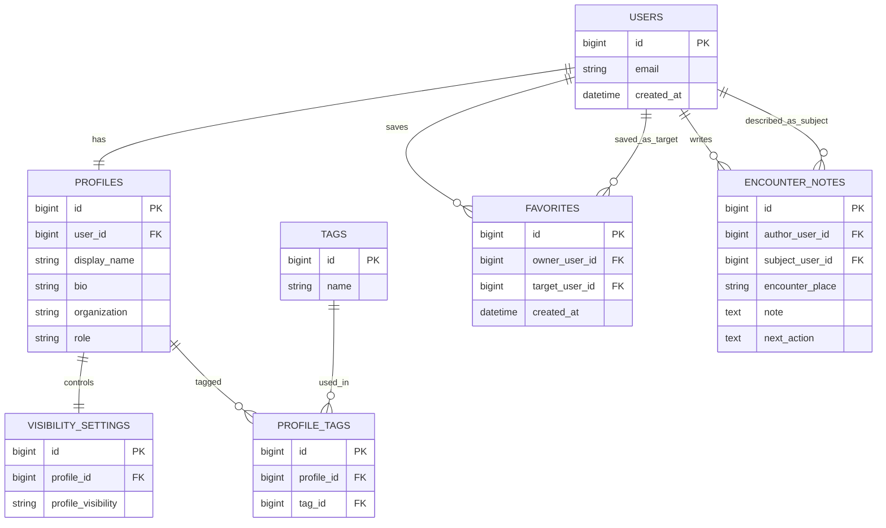

# Tsunagari

Tsunagari は、仕事やコミュニティで出会った相手を覚え、次の接点を
作りやすくするための「関係構築のための台帳」を目指す Web アプリです。

この README は、開発序盤における仕様書兼セットアップ手順です。
詳細設計よりも、MVP の判断と初期実装の現実性を優先しています。

## 1. プロダクト概要

最初から人脈 SNS を作るのではなく、次の 4 点に絞ります。

- 自分のプロフィールを整理する
- 相手を検索して把握する
- 接点の文脈を記録する
- 安心して情報を出し分ける

## 2. 解決したい課題

仕事やコミュニティで人と出会っても、時間が経つと次の情報が失われやすいです。

- 誰だったか
- どこで会ったか
- 何に興味があったか
- 次に何をきっかけに話せるか

一般的な SNS は発信や交流が主であり、接点の整理と再接続には必ずしも向いていません。
Tsunagari は「覚える」「探す」「また話しかける」を支援することを主目的にします。

## 3. 想定ユーザー

初期ターゲットは、仕事やコミュニティで人を覚えておきたい人です。

- 勉強会やイベントで会った相手を整理したい人
- 名刺交換後のフォローを忘れたくない人
- 同じコミュニティ内の人を役割や興味で探したい人

## 4. 提供価値

### 4.1 情報の出し分け

プロフィールを一律で公開するのではなく、公開範囲を制御できることを重視します。

- `public`: 未ログインでも見える
- `member`: ログインユーザーに見える
- `private`: 本人のみ見える

初期実装では項目単位で複雑にせず、プロフィール全体またはセクション単位の
公開範囲から始めます。

### 4.2 接点の文脈保持

単なる名簿ではなく、「次に話しかける理由」を残せることを価値にします。

- どこで会ったか
- 何を話したか
- 何に興味がありそうか
- 次に声をかけるなら何か

## 5. MVP の範囲

初期版では「保管する」「探す」「覚えておく」までを成立させます。

### 5.1 実装対象

- ユーザー登録 / ログイン
- 自分のプロフィール作成・編集
- 他ユーザーの公開プロフィール閲覧
- 名前、タグ、所属などによる検索
- 気になる相手の保存
- 接点メモの保存
- 公開範囲の設定

### 5.2 実装しないもの

- ダイレクトメッセージ
- 既読管理
- 通知一覧
- 相互承認型のコネクション
- レコメンドアルゴリズム
- タイムラインや投稿機能
- 招待、紹介、グループ機能
- 通報、ブロック、モデレーション機能

### 5.3 仕様上の判断

- `favorites` を先に実装し、`connections` は後回しにする
- `encounter_notes` は本人だけが見える private memo とする
- メッセージ機能は MVP に含めない
- 通知機能は MVP に含めない

## 6. 主要ユースケース

### 6.1 自分の情報を整える

1. ユーザー登録する
2. プロフィールを作成する
3. 所属、興味、自己紹介を設定する
4. 公開範囲を選ぶ

### 6.2 相手を探して把握する

1. 名前、タグ、所属で検索する
2. 公開プロフィールを見る
3. 気になる相手を保存する

### 6.3 次の接点を残す

1. 相手プロフィールを開く
2. 出会った場所や会話内容をメモする
3. 保存済み一覧や検索結果から見返す

## 7. 画面一覧

| 画面 | 目的 |
| --- | --- |
| トップ | サービス説明と導線を出す |
| ログイン / 新規登録 | 認証を行う |
| マイプロフィール | 自分の公開情報を確認する |
| プロフィール編集 | 自己紹介、所属、タグ、公開範囲を編集する |
| ユーザー検索一覧 | 名前、所属、タグで相手を探す |
| 他ユーザープロフィール | 公開されている相手の情報を見る |
| 保存済みユーザー一覧 | 気になる相手を見返す |

## 8. データモデルたたき台

| モデル | 役割 | 主な内容 |
| --- | --- | --- |
| `users` | 認証の主体 | メールアドレス、状態管理 |
| `profiles` | プロフィール本体 | 表示名、自己紹介、所属、役割 |
| `visibility_settings` | 公開範囲の制御 | `public` / `member` / `private` |
| `tags` | 検索用ラベル | 興味、領域、所属分類 |
| `profile_tags` | タグの中間テーブル | プロフィールとタグの多対多 |
| `favorites` | 保存した相手 | 片方向の保存関係 |
| `encounter_notes` | 接点メモ | 出会った場所、話題、次のアクション |

## 9. ER 図

初期実装を想定した最小構成です。`connections` や `messages` はまだ入れていません。



## 10. 主要ルール

### 10.1 公開ルール

- 未ログインユーザーは `public` 情報のみ閲覧可能
- ログインユーザーは `member` 情報を閲覧可能
- `private` 情報は本人のみ閲覧可能

### 10.2 メモの扱い

- `encounter_notes` は作成者本人のみ閲覧・編集できる
- 相手には表示しない

### 10.3 保存機能

- `favorites` は相手への通知なし
- 相互関係の成立は扱わない

## 11. 技術方針

初期構築は仕様変更に強いことを優先します。

- Rails モノリス
- PostgreSQL
- Hotwire / Turbo 中心
- 必要になるまで API 分離しない

## 12. 開発順

### Phase 1

- 認証
- プロフィール
- ルート画面

### Phase 2

- 検索
- タグ
- プロフィール閲覧

### Phase 3

- 保存機能
- 接点メモ
- 公開範囲

## 13. 未確定事項

- 認証方式の詳細
- 公開範囲をプロフィール単位にするかセクション単位にするか
- `favorites` から `connections` へ進化させるか
- 検索条件の最小セット
- プロフィール項目の初期セット

## 14. 現在の実装状況

- Rails scaffold only
- Ruby 3.3.9
- Rails 7.2.3
- PostgreSQL
- Hotwire via Turbo and Stimulus

まだプロダクト機能は未実装です。このリポジトリには、ベースとなる Rails アプリと
ローカル開発環境の設定が入っています。

## 15. ローカルセットアップ

1. Ruby 3.3.9 と PostgreSQL をインストールする
2. gem をインストールする

```sh
bundle install
```

3. データベースを作成して初期化する

```sh
bin/rails db:prepare
```

4. アプリを起動する

```sh
bin/rails server
```

`http://localhost:3000` で起動します。

## 16. テスト

```sh
bin/rails test
```

テスト実行前に、ローカルの PostgreSQL が起動している必要があります。
